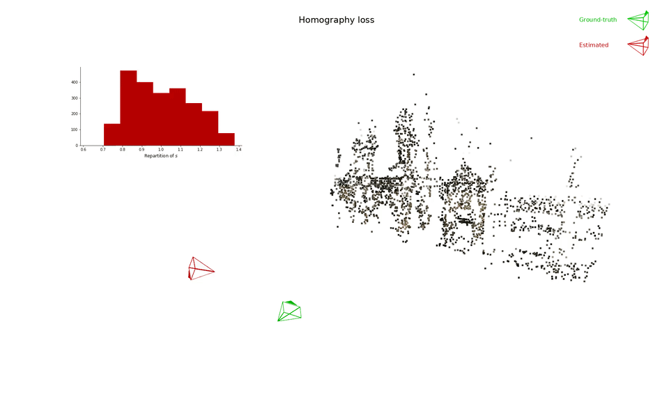

# Homography-Based Loss Function for Camera Pose Regression
In this repository, we share our implementation of several camera pose regression
loss functions in a simple end-to-end network similar to
[PoseNet](https://openaccess.thecvf.com/content_iccv_2015/html/Kendall_PoseNet_A_Convolutional_ICCV_2015_paper.html).
We implemented the homography-based loss functions introduced in our paper alongside PoseNet, Homoscedastic, Geometric
and DSAC loss functions. We provide the code to train and test the network on Cambridge, 7-Scenes and custom COLMAP
datasets.

Our paper [Homography-Based Loss Function for Camera Pose Regression](https://arxiv.org/abs/2205.01937) is published in IEEE Robotics and Automation Letters 2022.


*<p align="center">Convergence of our proposed Homography loss</p>*  
We show other losses convergence
[on our YouTube channel](https://youtube.com/playlist?list=PLe92vnufKoYIIHrW5I268RYdX6aV4gTa6). 

## Installation

### COLMAP dependancy
This code relies on COLMAP for loading COLMAP models. To satisfy this dependancy, simply run:
```shell
git submodule update --init
```

### Python environment setup
We share an [Anaconda](https://www.anaconda.com) environment that can be easily installed by running:
```shell
conda env create -f environment.yml
```
Anaconda is easy to install and benefits from a lighter implementation named
[Miniconda](https://docs.conda.io/en/latest/miniconda.html).  
Once the environment is installed you can activate it by running:
```shell
conda activate homographyloss
```

### Dataset setup
Have a look at the [datasets](datasets) folder to setup the datasets.

## Run relocalization
The script [main.py](main.py) trains the network on a given scene and logs the performance of the model on the
train set. It requires one positional argument: the path to the scene on which to train the model.
For example, for training the model on the ShopFacade scene, simply run:
```shell
python main.py datasets/ShopFacade
```
Let's say you have a custom dataset in `datasets/mydataset` with the structure defined in [datasets](datasets):
> - mydataset
>   - images
>     - frame001.jpg
>     - frame002.jpg
>     - frame003.jpg
>     - ...
>   - cameras.bin
>   - images.bin
>   - points3D.bin
>   - list_db.txt
>   - list_query.txt

Then you might run the script on your custom dataset:
```shell
python main.py datasets/mydataset
```

Other available training options can be listed by running `python main.py -h`.

## Monitor training and test results
Training and test metrics are saved in a `logs` directory. One can monitor them using tensorboard.
Simply run in a new terminal:
```shell
tensorboard --logdir logs
```

All estimated poses are also saved in a CSV file in `logs/[scene]/[loss]/epochs_poses_log.csv`.
For each epoch, each image and each set, we save the estimated pose in the following format:
- `w_t_chat` is the camera-to-world translation of the image.
- `chat_q_w` is the world-to-camera quaternion representing the rotation of the image.

## Acknowledgements
This work was supported by [Ifremer](https://wwz.ifremer.fr/), [DYNI](https://dyni.pages.lis-lab.fr/) team of [LIS laboratory](https://www.lis-lab.fr/) and [COSMER laboratory](https://cosmer.univ-tln.fr/).  

## License
This code is released under the LGPLv3 licence. Please have a look at the licence file at the repository root.

## Citation
If you use this work for your research, please cite:
```
@article{boittiaux2022homographyloss,
  author={Boittiaux, Clémentin and Marxer, Ricard and Dune, Claire and Arnaubec, Aurélien and Hugel, Vincent},
  journal={IEEE Robotics and Automation Letters},
  title={Homography-Based Loss Function for Camera Pose Regression},
  year={2022},
  volume={7},
  number={3},
  pages={6242-6249},
}
```
